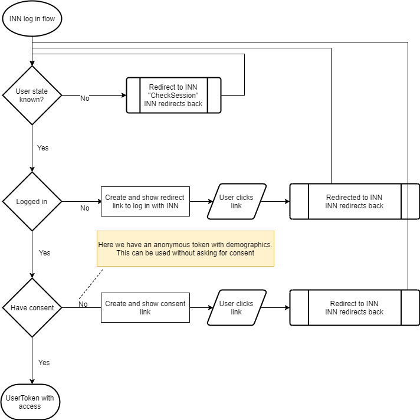

# 1881 INN and Episerver

## Description
This library can be used to integrate Episerver sites with [INN by Opplysningen 1881](https://inn.opplysningen.no). INN is a service for managing address information in one place and allows customers to use their address information accross environments without any hassle.

## Features
* Check INN user login status
* Retrieve address information from a users' INN account
* Manage INN address information
* Sync INN addresses for logged in users
* Fill in address forms based on INN addresses

## How to get started?
* ``install-package INN.Core``
* Configure appsettings, see `using the package` below

## Details

* INN.Core
  * IInnTokenService / ITokenApi
    * This service can be used to retrieve and validate auth tokens (application and user).
    * IAddressApi is a [refit wrapper](https://github.com/paulcbetts/refit) for the [INN Security Token Service STS](https://inn-prod-ss.opplysningen.no/innss/api/index.html#api-Security_Token_Service__STS_-logon), we recommend to use the service instead
  * IInnLoginService
    * This service can be used to check and handle the user's log in status with INN and provides relevant urls based on the user's state (think of: log in url, give consent url)
  * IInnAddressService / IAddressApi
    * The IInnAddressService provides methods to manage address information for an INN user 
    * IAddressApi is a [refit wrapper](https://github.com/paulcbetts/refit) for the [INN delivery address api](https://inn-prod-ss.opplysningen.no/innss/api/index.html#api-Delivery_Address), we recommend to use the service instead

### Using the package
In order for this package to work, you need to configure the endpoint urls and the information about the application in INN. Such applications can be set up by INN. The application has to be configured correctly in order for the redirects to work:

* `INN:TokenServiceUri` - url to token service api
* `INN:SingleSignOnServiceUri` - url to sso api
* `INN:ApplicationId` - the INN application guid
* `INN:ApplicationSecret` - the INN application secret
* `INN:ApplicationName` - the INN application name



The flow for INN is as follows:

* First we redirect to INN in order to check the users log in status
* Then we have to handle the different statuses
  * Not logged in
    * We display a "log in with INN" link
  * Logged in but we don't have consent
    * We display a "give consent" link
  * Logged in and we do have consent
    * We can now use the user token to retrieve address information from INN

The complete implementation in code looks a bit like this:
```csharp
var handleUserTokenUrl = Url.Action("RedirectResult", "Checkout", new { }, Request.Url?.Scheme ?? "http");
var returnToThisUrl = Request.Url?.AbsolutePath ?? "/en/checkout";
var innStatusResult = await _innLoginService.GetLoginStatus(
	_innUserTokenCache,
	handleUserTokenUrl,
	returnToThisUrl);
switch (innStatusResult.LoginStatus)
{
	case InnLoginStatus.Unknown:
		return Redirect(innStatusResult.Url);
	case InnLoginStatus.NotLoggedIn:
		// Show log in button
		loginUrl = innStatusResult.Url;
		break;
	case InnLoginStatus.NeedConsent:
		// Show consent button
		giveConsentUrl = innStatusResult.Url;
		break;
	case InnLoginStatus.LoggedIn:
		if (anonymousUser)
		{
			// Get customer addresses
			_innAddressService.GetUserAddresses(innStatusResult.UserToken.UserTokenId);
		}
		else
		{
			// Get customer addresses sync them to the customer contact addresses
			_innAddressService.SyncAddresses(CurrentContact, innStatusResult.UserToken.UserTokenId);
		}
}
```

And in this example we need an action called `RedirectResult` that handles the redirect result from INN:
```csharp
[HttpGet]
public async Task<ActionResult> RedirectResult(string userticket = "", string returnToUrl = "")
{
	await _innLoginService.HandleRedirectResult(_innUserTokenCache, userticket);
	return Redirect(returnToUrl);
}
```

By default the usertoken will be stored in a cookie (but this can be changed by implementing a custom IInnUserTokenCache). 
Addresses will be synced with the CustomerContext.Current.CurrentContact.ContactAddresses, see ``CustomSyncInnAddresses`` in the demo site for a custom implementation using the Quicksilver IAddressBookService.
	
## More info
[INN by Opplysningen 1881](https://inn.opplysningen.no/)

[INN SelfService - Documentation documentation](https://inn-prod-ss.opplysningen.no/innss/docs.html)

* Production
  * STS - token api - https://inn-prod-sts.opplysningen.no/tokenservice
  * SSO api - https://sso.opplysningen.no/oidsso
  * Useradmin (backoffice) for admin account (see 1password) - https://inn-prod-uawa.opplysningen.no/useradmin
  * Backoffice for non admin - https://inn-prod-ss.opplysningen.no/innss/
* QA 
  * STS - token api - https://inn-qa-sts.opplysningen.no/tokenservice
  * SSO api - https://inn-qa-oidsso.opplysningen.no/oidsso
  * Useradmin (backoffice) for admin account (see 1password)  - https://inn-qa-uaswa.opplysningen.no/useradmin
  * Backoffice for non admin - https://inn-qa-ss.opplysningen.no/innss/

## Demo
There is a public demo site based on Quicksilver available [here](http://inn-epi.geta.no/). Code can be found in the demo folder.

## Package maintainer
[Brian Weeteling](https://github.com/brianweet)

## Changelog
[Changelog](CHANGELOG.md)